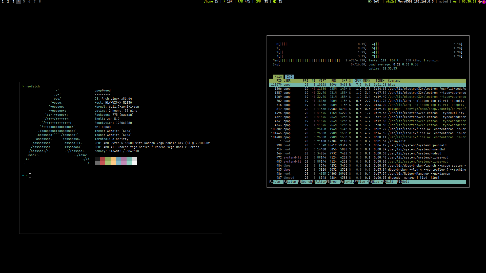
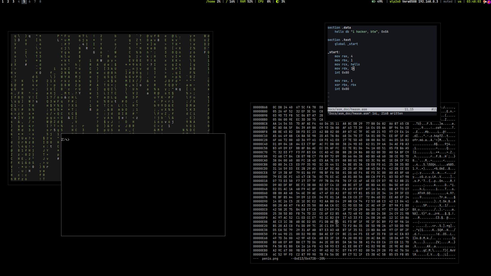
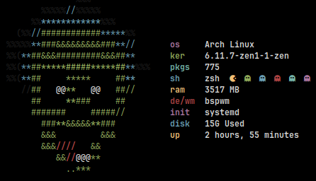

# 
BSPWM CONFIG

# About 
 - OS: [**`Arch Linux`**](https://archlinux.org/)
 - Kernel: [**`Linux zen`**](https://archlinux.org/packages/extra/x86_64/linux-zen/)
 - WM: [**`BSPWM`**](https://github.com/baskerville/bspwm)
 - Bar: [**`Polybar`**](https://github.com/polybar/polybar)
 - Terminal: [**`Alacritty`**](https://github.com/alacritty/alacritty)
 - App Launcher: [**`Rofi`**](https://github.com/davatorium/rofi)
 - Notify Daemon: [**`Dunst`**](https://github.com/dunst-project/dunst)
 - Shell: [**`Zsh`**](https://github.com/ohmyzsh/ohmyzsh.git)

# Монтирование дисков
├─nvme0n1p1 259:1    0   100G  0 part /
├─nvme0n1p2 259:2    0   240G  0 part /home
├─nvme0n1p3 259:3    0   940M  0 part /efi
├─nvme0n1p4 259:4    0   120G  0 part /data
└─nvme0n1p5 259:5    0    16G  0 part [SWAP]

