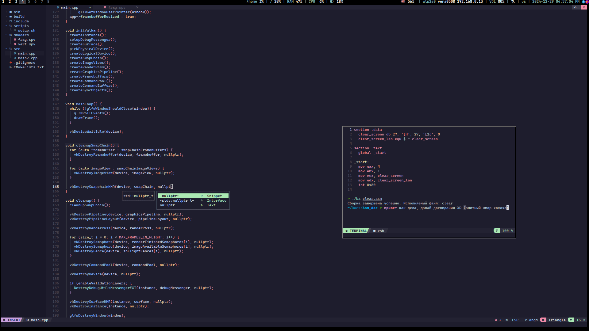

# 
BSPWM CONFIG

# About 
 - OS: [**`Arch Linux`**](https://archlinux.org/)
 - Kernel: [**`Linux zen`**](https://github.com/zen-kernel/zen-kernel)
 - WM: [**`BSPWM`**](https://github.com/baskerville/bspwm)
 - Bar: [**`Polybar`**](https://github.com/polybar/polybar)
 - Terminal: [**`Alacritty`**](https://github.com/alacritty/alacritty)
 - App Launcher: [**`Rofi`**](https://github.com/davatorium/rofi)
 - Notify Daemon: [**`Dunst`**](https://github.com/dunst-project/dunst)
 - Shell: [**`Zsh`**](https://github.com/ohmyzsh/ohmyzsh.git)

# Images Desktop

# Disk Partitions
#### 1 - 100Gb - /

#### 2 - 240Gb - /home

#### 3 - 940Mb - /efi

#### 4 - 120Gb - /data

#### 5 - 16Gb - [SWAP] (Так много, потому что некуда было 16 гигов девать)

# About files
### [bin](bin) - Самописные скрипты, находящиеся в /usr/local/bin/ (Некоторые из них бинарные, так что прочитать исходники не получится).

### [bspwm](config_files/bspwm) - Дерриктория, находящаяся в ~/.config/ . Содержит в себе конфигурацию моего bspwm, и папку со скриптами, которые запускаются вместе с bspwm. Сделано именно так, чтобы в любой момент можно было перезапустить их все, просто нажав Super + Alt + r.

### [docs](docs) - Дерриктория, со изображениями моей системы

### [polybar](config_files/polybar) - Дерриктория, содержащая конфигурацию моего polybar. Находиться в ~/.config/ .

### [alacritty.toml](config_files/alacritty.toml) - Файл конфигурации эмулятора терминала - alacritty. Находиться в ~/.config/alacritty/ .

### [sxhkdrc](config_files/sxhkdrc) - Файл конфигурации шорткатов моей системы. Находиться по пути ~/.config/sxhkdrc/ .

### [vscode_settings](config_files/vscode_settings) - Файл конфигурации Vs code OSS.

### [zshrc](config_files/zshrc) - Файл конфигурации моей оболочки zsh. (Как по мне alias с btw, это гениально)

# PS.
Данная конфигурация писалась сомостоятельно втечении чуть больше полугода. Именно столько я пользуюсь Arch linux и линукс в целом (И да, мой первый линукс именно Arch, и ставил его своими руками, а не через скрипт, как можно подумать).

В планах перейти на DWM и поменять эмулятор терминала, на использующий Vulkan API, а не OpenGL.